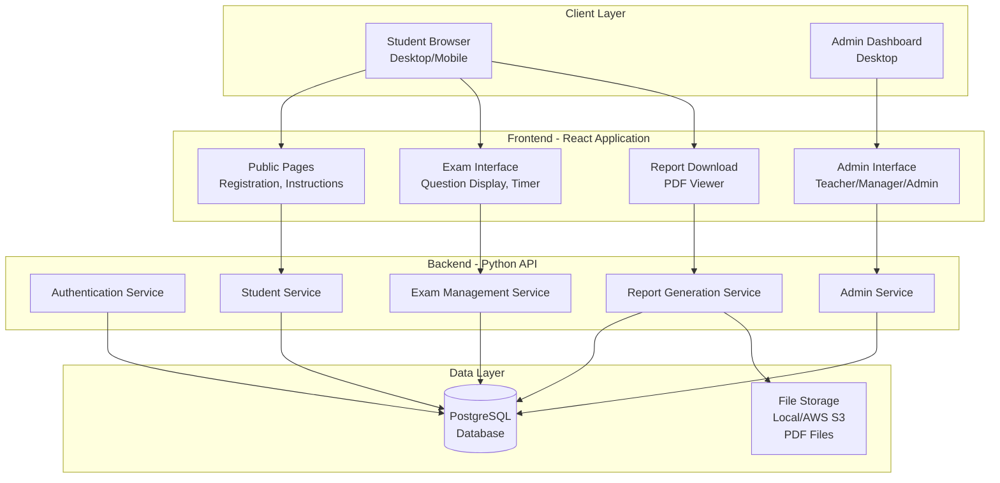

# System Architecture

## Online Assessment Platform

### 📐 High-Level Architecture



---

## Technology Stack Decision

### Frontend Stack

| Component            | Technology                          | Justification                                                      |
| -------------------- | ----------------------------------- | ------------------------------------------------------------------ |
| **Framework**        | React 18+                           | Component-based, excellent ecosystem, team familiarity             |
| **State Management** | React Context + useState/useReducer | Simple enough for this app, avoid Redux overhead                   |
| **Routing**          | React Router v6                     | Standard routing solution, supports protected routes               |
| **HTTP Client**      | Axios                               | Clean API, interceptors for auth, better error handling than fetch |
| **Styling**          | CSS Modules or Styled Components    | Scoped styles, prevents conflicts, easy maintenance                |
| **Form Handling**    | React Hook Form                     | Performance, built-in validation, minimal re-renders               |
| **Timer**            | Custom hook with setInterval        | Precise countdown control, easy to test                            |
| **PDF Viewer**       | react-pdf                           | Display PDFs in browser before download                            |
| **UI Components**    | Material-UI (MUI) or Custom         | Fast development vs. full control - team to decide                 |

**Build Tool**: Vite (faster than Create React App)

---

### Backend Stack

| Component             | Technology                | Justification                                               |
| --------------------- | ------------------------- | ----------------------------------------------------------- |
| **Framework**         | FastAPI                   | Modern, fast, automatic API docs, async support, type hints |
| **Authentication**    | JWT (JSON Web Tokens)     | Stateless, scalable, works well with SPAs                   |
| **ORM**               | SQLAlchemy 2.0+           | Modern Python ORM with type hints, async support            |
| **PDF Generation**    | ReportLab or WeasyPrint   | Python-native, HTML/CSS to PDF conversion                   |
| **Validation**        | Pydantic                  | Built into FastAPI, automatic request validation            |
| **Testing**           | pytest                    | Standard Python testing framework                           |
| **API Documentation** | Auto-generated by FastAPI | Swagger UI out of the box                                   |

**Python Version**: 3.10+

---

### Database Choice

> [!IMPORTANT]
> **Decision: PostgreSQL** - Chosen for learning SQL, better control, and industry-standard skills development.

#### Why PostgreSQL?

**Learning Value**:

- ✅ Teaches proper relational database design
- ✅ SQL skills are industry-standard and transferable
- ✅ Understanding of ACID transactions and data integrity
- ✅ Experience with migrations and schema evolution
- ✅ Real-world experience with production databases

**Technical Benefits**:

- ✅ Full SQL capabilities (complex joins, aggregations, window functions)
- ✅ Excellent performance with proper indexing
- ✅ JSONB support for semi-structured data when needed
- ✅ Strong data integrity with foreign keys and constraints
- ✅ Robust ecosystem (pgAdmin, monitoring tools, extensions)

**Production Advantages**:

- ✅ No vendor lock-in - can deploy anywhere (cloud or on-premise)
- ✅ Better for reporting and analytics
- ✅ Mature backup and replication solutions
- ✅ Cost-effective at scale
- ✅ Used by companies of all sizes (Uber, Instagram, Spotify)

**File Storage**: Local filesystem for development, AWS S3 or similar for production (for PDF reports)

---

### Data Model

#### Core Entities

**Students**

```
- id (UUID/string)
- firstName (string)
- lastName (string)
- phoneNumber (string)
- registrationDate (timestamp)
- examStatus (enum: not_started, in_progress, completed)
- timeRemaining (integer, seconds)
```

**Exams**

```
- id (UUID/string)
- subject (enum: math, english)
- title (string)
- duration (integer, minutes)
- totalQuestions (integer)
- questionsPerPage (integer)
- createdBy (teacher ID)
- createdAt (timestamp)
- isActive (boolean)
```

**Questions**

```
- id (UUID/string)
- examId (foreign key)
- questionText (string)
- questionType (enum: multiple_choice, short_answer)
- choices (array of strings)
- correctAnswer (string/index)
- points (integer)
- orderIndex (integer)
```

**StudentResponses**

```
- id (UUID/string)
- studentId (foreign key)
- examId (foreign key)
- questionId (foreign key)
- answer (string)
- isCorrect (boolean)
- answeredAt (timestamp)
```

**Reports**

```
- id (UUID/string)
- studentId (foreign key)
- mathScore (float)
- englishScore (float)
- pdfUrl (string)
- generatedAt (timestamp)
```

**Users** (Staff: Admin, Manager, Teacher)

```
- id (UUID/string)
- email (string)
- passwordHash (string)
- role (enum: admin, manager, teacher)
- firstName (string)
- lastName (string)
- createdAt (timestamp)
```

---

## API Architecture

### RESTful API Endpoints

#### Student Endpoints

```
POST   /api/students/register
GET    /api/students/{studentId}
GET    /api/students (admin/manager only)
```

#### Exam Endpoints

```
GET    /api/exams/active
GET    /api/exams/{examId}
POST   /api/exams (teacher/admin only)
PUT    /api/exams/{examId} (teacher/admin only)
DELETE /api/exams/{examId} (admin only)
```

#### Question Endpoints

```
GET    /api/exams/{examId}/questions?page={n}
POST   /api/exams/{examId}/questions (teacher/admin only)
PUT    /api/questions/{questionId} (teacher/admin only)
DELETE /api/questions/{questionId} (admin only)
```

#### Response Endpoints

```
POST   /api/responses
GET    /api/responses/student/{studentId}
POST   /api/exams/{examId}/submit
```

#### Report Endpoints

```
GET    /api/reports/student/{studentId}
POST   /api/reports/generate/{studentId}
GET    /api/reports/{reportId}/download
```

#### Authentication Endpoints

```
POST   /api/auth/login (staff only)
POST   /api/auth/logout
GET    /api/auth/me
```

---

## Security Architecture

### Student Flow (No Authentication Required)

1. Student registers with basic info
2. Backend generates a **session token** (JWT with 2-hour expiration)
3. Token stored in sessionStorage (not localStorage - expires when browser closes)
4. Token grants access to exam for that specific student only
5. Token becomes invalid after exam submission

### Staff Flow (Full Authentication)

1. Staff logs in with email/password
2. Backend validates credentials, returns JWT with role claim
3. Token stored in localStorage
4. Protected routes check role before allowing access
5. API validates role on every request

### Data Protection

- **HTTPS Only**: All API calls must use TLS
- **CORS Configuration**: Only allow frontend domain
- **Input Validation**: Pydantic models validate all inputs
- **SQL Injection Prevention**: ORM parameterized queries
- **Rate Limiting**: Prevent brute force on login, spam registrations

---

## Deployment Architecture

### Development Environment

```
Frontend: http://localhost:5173 (Vite dev server)
Backend:  http://localhost:8000 (FastAPI uvicorn)
Database: PostgreSQL Docker container or local installation
```

### Production Environment

**Option 1: Cloud Deployment (Recommended)**

- **Frontend**: Vercel or Netlify (free tier, auto-deploy from GitHub)
- **Backend**: Railway, Render, or Fly.io (Python support)
- **Database**: Railway PostgreSQL, Render PostgreSQL, or AWS RDS
- **File Storage**: AWS S3 or Cloudflare R2 for PDFs

**Option 2: Traditional Server**

- **Frontend**: Nginx serving static React build
- **Backend**: Gunicorn + Uvicorn workers
- **Database**: Self-hosted PostgreSQL
- **Reverse Proxy**: Nginx

---

## Scalability Considerations

### Current Requirements

- **Concurrent Users**: ~50-100 students (9th grade cohort)
- **Exam Duration**: ~60 minutes
- **Peak Load**: All students starting exam simultaneously

### Architecture supports scaling to:

- **1000+ concurrent users** with proper infrastructure
- **Multiple exam sessions** running in parallel
- **Question bank** of 1000+ questions
- **Multi-year student data** retention

### Performance Targets

| Metric             | Target  | Strategy                          |
| ------------------ | ------- | --------------------------------- |
| Page Load          | < 2s    | Code splitting, lazy loading, CDN |
| API Response       | < 500ms | Database indexing, caching        |
| PDF Generation     | < 5s    | Background job processing         |
| Auto-save Response | < 300ms | Debounced saves, optimistic UI    |

---

## Development Workflow

### Repository Structure

```
assessment-platform/
├── frontend/               # React application
│   ├── src/
│   │   ├── components/    # Reusable UI components
│   │   ├── pages/         # Route-based page components
│   │   ├── hooks/         # Custom React hooks
│   │   ├── services/      # API service layer
│   │   ├── context/       # React Context providers
│   │   └── utils/         # Helper functions
│   ├── public/
│   └── package.json
│
├── backend/               # Python FastAPI application
│   ├── app/
│   │   ├── api/          # API route handlers
│   │   ├── models/       # Database models
│   │   ├── schemas/      # Pydantic schemas
│   │   ├── services/     # Business logic
│   │   └── utils/        # Helper functions
│   ├── tests/
│   └── requirements.txt
│
├── docs/                 # Project documentation
└── README.md
```

### Git Workflow

1. **Main branch**: Production-ready code only
2. **Develop branch**: Integration branch
3. **Feature branches**: `feature/epic-name-story-name`
4. **Pull Requests**: Required for all merges, code review by team lead

### API Contract Management

- **OpenAPI Schema**: Backend auto-generates, frontend consumes
- **API Versioning**: `/api/v1/` prefix for future compatibility
- **Contract Testing**: Frontend mocks backend responses during development

---

## Testing Strategy

### Frontend Testing

- **Unit Tests**: Jest + React Testing Library (components, hooks)
- **Integration Tests**: API service layer with mocked responses
- **E2E Tests**: Playwright or Cypress (critical user flows)

### Backend Testing

- **Unit Tests**: pytest (service layer, utility functions)
- **Integration Tests**: Test API endpoints with test database
- **Load Tests**: Locust or Apache JMeter (before production)

### Manual Testing

- **User Acceptance Testing**: Have actual 9th graders test the interface
- **Cross-browser Testing**: Chrome, Firefox, Safari
- **Mobile Testing**: iOS Safari, Android Chrome

---

**Architecture Version**: 1.0  
**Last Updated**: February 5, 2026  
**Status**: Proposed - Awaiting Team Lead Approval
