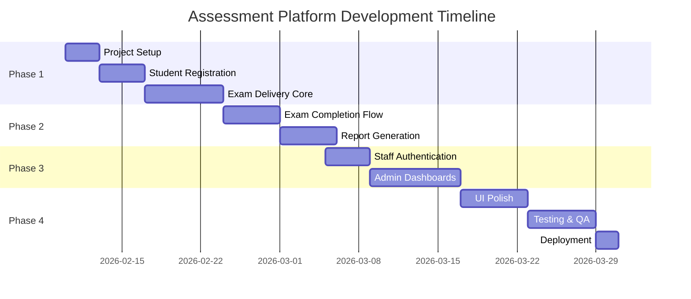
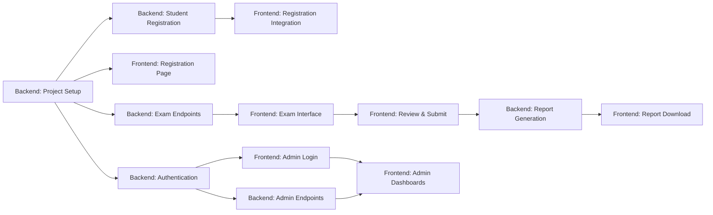

# Implementation Timeline & Phasing

## Online Assessment Platform

---

## Development Phases Overview

**Total Duration**: ~7 weeks (with 2 developers working in parallel)

---

## Phase 1: Core Student Flow (Weeks 1-2)

**Goal**: Students can register, view instructions, and complete exams

### Week 1: Foundation

**Backend Tasks**:

- [ ] Project setup (Story 1.1, 1.2, 1.3) - 12 hours
- [ ] Student registration API (Story 2.1, 2.2) - 9 hours
- [ ] Exam models and active exams endpoint (Story 3.1, 3.2) - 8 hours

**Frontend Tasks**:

- [ ] Landing page with registration (Story 1.1) - 8 hours
- [ ] Routing structure (Story 1.2) - 4 hours
- [ ] Instructions page (Story 2.1) -4 hours

**Milestone**: Student can register and see exam instructions

---

### Week 2: Exam Delivery

**Backend Tasks**:

- [ ] Paginated questions endpoint (Story 3.3) - 5 hours
- [ ] Student response model and save endpoint (Story 4.1, 4.2) - 8 hours

**Frontend Tasks**:

- [ ] Question display component (Story 3.1) - 6 hours
- [ ] Paginated exam interface (Story 3.2) - 10 hours
- [ ] Auto-save functionality (Story 3.3) - 5 hours
- [ ] Timer integration (Story 1.3, 3.4) - 12 hours

**Milestone**: Student can complete full exam with timer

---

## Phase 2: Exam Completion & Reports (Weeks 3-4)

### Week 3: Submission Flow

**Backend Tasks**:

- [ ] Submit exam endpoint (Story 4.3) - 4 hours
- [ ] PDF report generation service (Story 5.1) - 10 hours

**Frontend Tasks**:

- [ ] Review page (Story 4.1) - 5 hours
- [ ] Prevent re-entry (Story 4.2) - 4 hours
- [ ] Report download page (Story 5.1) - 6 hours

**Milestone**: Students can submit exam and access report page

---

### Week 4: Report Generation

**Backend Tasks**:

- [ ] Generate report endpoint (Story 5.2) - 8 hours
- [ ] Download report endpoint (Story 5.3) - 3 hours

**Frontend Tasks**:

- [ ] PDF download implementation (Story 5.2) - 3 hours
- [ ] Start design system (Story 8.1) - 8 hours

**Milestone**: Complete student journey (registration → exam → PDF report)

**🎯 DEMO CHECKPOINT**: Present working student flow to stakeholders

---

## Phase 3: Admin Features (Weeks 5-6)

### Week 5: Authentication & Teacher Dashboard

**Backend Tasks**:

- [ ] JWT utilities (Story 6.1) - 5 hours
- [ ] Staff user model (Story 6.3) - 3 hours
- [ ] Staff login endpoint (Story 6.2) - 6 hours
- [ ] RBAC middleware (Story 6.4) - 4 hours
- [ ] Create question endpoint (Story 7.2) - 5 hours
- [ ] Update/delete question (Story 7.3) - 4 hours

**Frontend Tasks**:

- [ ] Staff login page (Story 6.1) - 6 hours
- [ ] Protected admin routes (Story 6.2) - 5 hours
- [ ] Teacher dashboard (Story 7.1) - 12 hours

**Milestone**: Teachers can log in and manage questions

---

### Week 6: Manager & Admin Dashboards

**Backend Tasks**:

- [ ] Get all students endpoint (Story 7.1) - 5 hours
- [ ] Admin statistics endpoint (Story 7.4) - 6 hours
- [ ] User management endpoints (Story 7.5) - 8 hours

**Frontend Tasks**:

- [ ] Manager dashboard (Story 7.2) - 10 hours
- [ ] Admin dashboard (Story 7.3) - 12 hours

**Milestone**: Full admin panel operational

---

## Phase 4: Polish & Launch (Weeks 7-8)

### Week 7: UI/UX Polish

**Backend Tasks**:

- [ ] Pydantic schemas (Story 8.1) - 6 hours
- [ ] API documentation (Story 8.2) - 4 hours
- [ ] Error handling (Story 8.3) - 5 hours
- [ ] Rate limiting (Story 9.1) - 4 hours
- [ ] Database indexing (Story 9.2) - 3 hours

**Frontend Tasks**:

- [ ] Complete design system (Story 8.1) - 8 hours remaining
- [ ] Mobile responsiveness (Story 8.2) - 10 hours
- [ ] Loading & error states (Story 8.3) - 8 hours

**Milestone**: Production-ready UI and optimized backend

---

### Week 8: Testing & Deployment

**Backend Tasks**:

- [ ] Unit tests (Story 10.1) - 12 hours
- [ ] Integration tests (Story 10.2) - 14 hours
- [ ] Load testing (Story 10.3) - 6 hours
- [ ] Security configuration (Story 9.3) - 3 hours

**Frontend Tasks**:

- [ ] Unit tests (Story 9.1) - 12 hours
- [ ] E2E tests (Story 9.2) - 16 hours

**Deployment Tasks**:

- [ ] Set up production environment
- [ ] Configure database (production)
- [ ] Deploy backend to hosting service
- [ ] Deploy frontend to Vercel/Netlify
- [ ] SSL certificate setup
- [ ] Final smoke testing

**Milestone**: Application deployed and production-ready

**🚀 LAUNCH**: Assessment platform goes live

---

## Resource Allocation

### 2-Developer Team (Recommended)

**Developer 1: Frontend Specialist**

- Focus on all frontend stories (Epics 1-9 from frontend backlog)
- Responsible for UI/UX consistency
- Owns frontend testing

**Developer 2: Backend Specialist**

- Focus on all backend stories (Epics 1-10 from backend backlog)
- Responsible for API design and security
- Owns backend testing

**You (Team Lead)**:

- Code reviews for both frontend and backend
- API contract verification
- Integration testing coordination
- Stakeholder communication
- Deployment and DevOps

### 3-Developer Team (Faster Timeline: 5 weeks)

**Developer 1**: Frontend Student Flow (Epics 1-5)
**Developer 2**: Frontend Admin Features + UI (Epics 6-8)
**Developer 3**: Backend (All Epics)
**Team Lead**: Testing (Epic 9), Code Reviews, Deployment

### 4-Developer Team (Fastest: 4 weeks)

**Developers 1-2**: Frontend (split student vs admin features)
**Developers 3-4**: Backend (split core platform vs admin features)
**Team Lead**: Integration, Testing, Deployment

---

## Critical Path Dependencies

**Critical Path**: Project Setup → Registration → Exam Delivery → Report Generation

**Parallel Paths**:

- Admin features can be developed in parallel with core student flow
- UI polish can be done incrementally throughout
- Testing should start early (write tests as you build features)

---

## Risk Mitigation

### High-Risk Areas

**1. PDF Generation Performance**

- **Risk**: PDF generation takes > 5 seconds
- **Mitigation**:
  - Implement async job processing (Celery or background tasks)
  - Pre-generate report templates
  - Load test early (Week 4)

**2. Timer Reliability**

- **Risk**: Timer doesn't persist across page refreshes
- **Mitigation**:
  - Store start time in sessionStorage + backend
  - Sync with backend every 60 seconds
  - Test thoroughly on Week 2

**3. Mobile Usability**

- **Risk**: Students struggle with mobile interface
- **Mitigation**:
  - Test on real devices starting Week 2
  - Get student feedback early (Week 4 demo)
  - Prioritize touch-friendly UI

**4. Concurrent User Load**

- **Risk**: System crashes with 100 simultaneous students
- **Mitigation**:
  - Load testing in Week 8
  - Database connection pooling
  - Consider read replicas if needed

---

## Quality Gates (Must Pass Before Next Phase)

### Phase 1 → Phase 2

- [ ] Student can register without errors
- [ ] Exam displays 5 questions per page
- [ ] Timer counts down correctly
- [ ] Answers are saved to backend
- [ ] No console errors

### Phase 2 → Phase 3

- [ ] Student can complete both Math and English exams
- [ ] PDF report generates successfully
- [ ] Student can download PDF
- [ ] Report contains correct scores
- [ ] Cannot re-enter completed exam

### Phase 3 → Phase 4

- [ ] All staff roles can log in
- [ ] Teachers can create/edit questions
- [ ] Managers can view student list
- [ ] Admin dashboard shows statistics
- [ ] Role-based access working correctly

### Phase 4 → Launch

- [ ] All unit tests passing (70%+ coverage)
- [ ] E2E tests passing
- [ ] Load test: 100 concurrent users, < 2s response time
- [ ] Mobile tested on iOS and Android
- [ ] Security audit complete (no hardcoded secrets, HTTPS, etc.)
- [ ] Stakeholder demo approved

---

## Communication Plan

### Weekly Standups

**Monday 9:00 AM**: Sprint planning, assign stories
**Friday 4:00 PM**: Demo progress, retrospective

### Daily Async Updates (Slack/Discord)

Each developer posts:

- What I completed yesterday
- What I'm working on today
- Any blockers

### Code Reviews

- All PRs require team lead approval
- Max 24-hour review turnaround
- Use PR template with checklist

### Stakeholder Demos

- **Week 4**: Student flow demo
- **Week 6**: Admin features demo
- **Week 8**: Final pre-launch demo

---

## Definition of Done (for each story)

- [ ] Code written and tested locally
- [ ] Unit tests written (if applicable)
- [ ] API documented (backend) or component documented (frontend)
- [ ] Code reviewed and approved
- [ ] Merged to develop branch
- [ ] Feature verified in integration environment
- [ ] No linting errors
- [ ] Acceptance criteria met

---

## Success Metrics (Post-Launch)

**Week 1 Post-Launch**:

- [ ] 90%+ students complete registration successfully
- [ ] < 5% support requests related to exam interface
- [ ] Average exam completion time within expected range
- [ ] Zero data loss incidents

**Month 1 Post-Launch**:

- [ ] All assessment reports generated successfully
- [ ] System uptime > 99%
- [ ] Average API response time < 1s
- [ ] Teachers have created 50+ questions

---

**Timeline Version**: 1.0  
**Created**: February 5, 2026  
**Team Lead**: Review and adjust based on your team's capacity and timeline constraints
